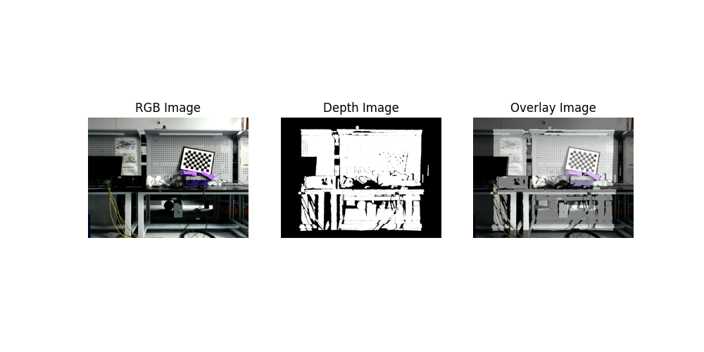
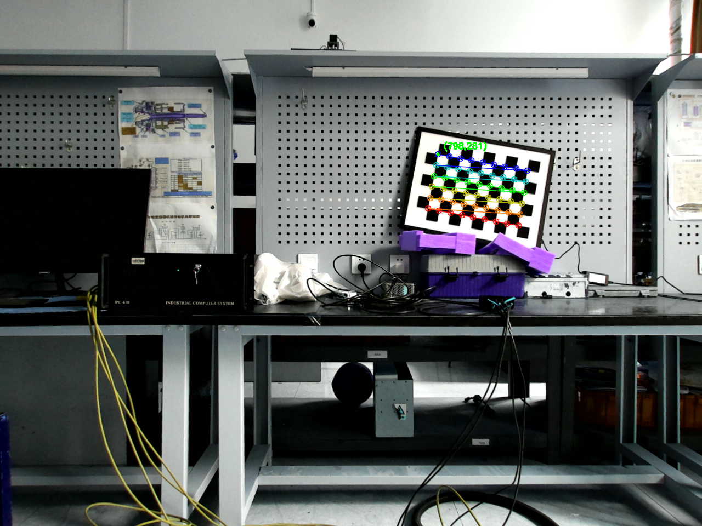
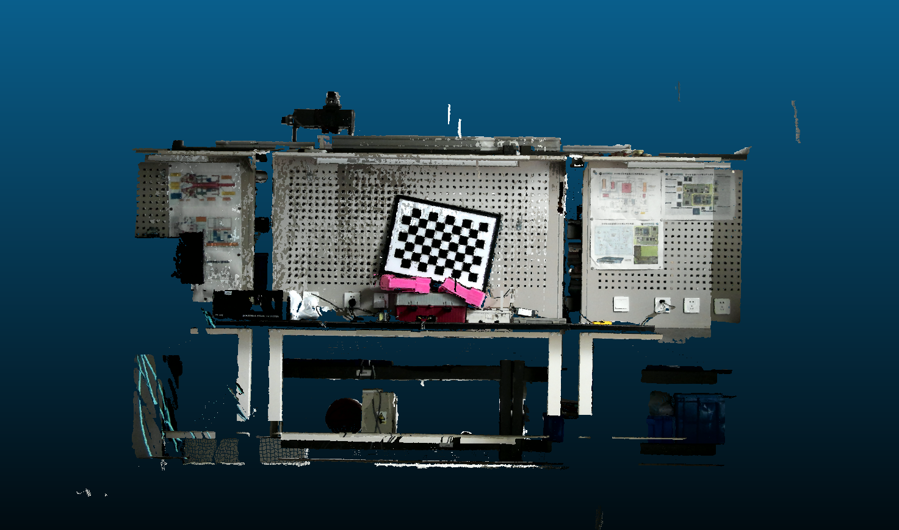

# 多图漾相机拼接
## 1. 图像采集
使用图漾提供的脚本采集对齐后的深度图（MappedDepth, CV16U）和去畸变后的彩色图像(color_data_mat)，操作与保存xyzrgb格式点云一致。保存的文件名以及意义如下所示：
- MappedDepth-0.jpg : 压缩后的深度图，用于检查与RGB图的对齐效果
- MappedColor-0.png : 单通道16位无符号整数，用于读取深度图中每个像素对应的深度
- undistortion-0.png : 去畸变后的RGB图像
- p3dtocolor-0.xyz : XYZRGB格式的点云

## 2. 修改配置文件
根据实际的相机设置修改[config.yaml](config.yaml)中的参数，特别是camera_location（相机位置）。具体参数说明在[config.yaml](config.yaml)中。

## 3. 检查对齐效果
使用[check_align.py](check_align.py)来检查深度图与RGB图的对齐效果并保存，如图所示:

## 4. 提取棋盘格角点
使用[get_corners_points.py](get_corners_points.py)来获取棋盘格角点,如图所示：

根据相机内参和深度图，还原棋盘格角点在RGB相机坐标系下的三维坐标并保存。

## 5. 求相机之间的变换矩阵
使用[register_pointclouds.py](register_pointclouds.py)读取步骤4中不同相机中同一棋盘格角点的三维坐标，使用Kabsch算法求解变换矩阵，默认对齐到left-top（左上）相机。

## 6. 点云拼接
使用CloudCompare打开xyz文件，并选中待变换的点云，在菜单栏选择Edit->Apply Transformation，修改变换矩阵为步骤5中求得的结果，点击OK即可完成拼接。拼接结果如图所示：
